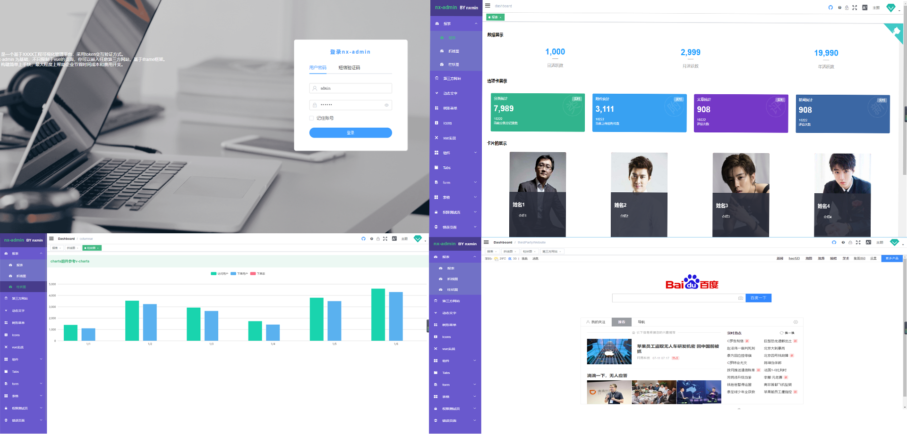

<p align="center">
  
</p>

<p align="center">
  <a href="https://github.com/vuejs/vue">
    
  </a>
  <a href="https://github.com/ElemeFE/element">
    
  </a>
   <a href="https://travis-ci.org/mgbq/nx-admin" rel="nofollow">
    
  </a>
    <a href="https://github.com/mgbq/nx-admin/blob/master/LICENSE">
    
  </a>
  <a href="https://github.com/mgbq/nx-admin/releases">
    
  </a>
  
  > ## :gem: Vue Automated management system
</p>

English | [简体中文](./README.md)

## Introduction

[nx-admin](https://mgbq.github.io/vue-permission/#/login) is a front-end management background integration solution. It based on [vue](https://github.com/vuejs/vue) and use the UI Toolkit [element](https://github.com/ElemeFE/element).

It is a magical vue admin based on the newest development stack of vue, built-in i18n solution, typical templates for enterprise applications, lots of awesome features. It helps you build a large complex Single-Page Applications.Help individuals and businesses to the greatest extent, saving time and money.

[document](https://mgbq.github.io/nx-admin-site/)

**Full edition**

[Github entrepot ](https://github.com/mgbq/nx-admin) | 
[Gitee entrepot](https://gitee.com/symgg/nx-admin) | 
[Preview](https://mgbq.github.io/vue-permission/#/login)



**simplified**

[Github entrepot](https://github.com/mgbq/nxAdmin-template) | 
[Gitee entrepot](https://gitee.com/symgg/nxAdmin-template) | 
[Preview](https://mgbq.github.io/nxAdmin-template)


## Preparation

You need to install [node](http://nodejs.org/) and [git](https://git-scm.com/) locally. The project is based on [ES2015+](http://es6.ruanyifeng.com/), [vue](https://cn.vuejs.org/index.html), [vuex](https://vuex.vuejs.org/zh-cn/), [vue-router](https://router.vuejs.org/zh-cn/), [axios](https://github.com/axios/axios) and [element-ui](https://github.com/ElemeFE/element), all request data is simulated using [Mock.js](https://github.com/nuysoft/Mock).
 Understanding and learning this knowledge in advance will greatly help the use of this project.
 
 ## related documents
[老板让我十分钟上手nx-admin](https://juejin.im/post/5b43226c51882519ad616c2a)

[Vue2.0实现的用户权限控制](http://blog.csdn.net/qq_32340877/article/details/79416344)

[Vue2.0-基于elementui换肤[自定义主题]](https://blog.csdn.net/qq_32340877/article/details/80176987)

[Vue国际化处理 vue-i18n 以及项目自动切换中英文](https://blog.csdn.net/qq_32340877/article/details/80148913)

[搭建 Vue2 单元测试环境(karma+mocha+webpack3)](https://juejin.im/post/5b051519f265da0b8f62e94e)

[Vue实现首屏加载等待动画](https://juejin.im/post/5b336699e51d4558a846dcc2)

[Vue项目中添加锁屏功能](https://juejin.im/post/5b35e05ee51d4558a75ea159)

[Vue项目添加动态浏览器头部title](https://juejin.im/post/5b446e24e51d45194d4fce14)

#### This project borrows from the pattern of the flower vents  [vueAdmin-template](https://github.com/PanJiaChen/vueAdmin-template)

This project does not support low version browsers (e.g. IE). Please add polyfill yourself if you need them.

Note: This project uses element-ui@2.3.0+ version, so the minimum compatible vue@2.5.0+

## download

git：`git clone https://github.com/mgbq/nx-admin.git`

npm：`npm install`


## Preview [nx-admin](https://mgbq.github.io/vue-permission/#/login)

test account:

``` bash
1. username: admin
   password: any
2. username: editor
   password: any
```

> nx-admin project

nx-admin Is a completely open source free management system integration solution，By nxmin driven by interest after the work finished, if you also like the front-end development, welcome to join our discussion/study groups, in the same group can answer questions, share learning materials or just bullshit

QQ群

群号 493671066 欢迎大家


## other matters needing attention ##
### 一、If I don't want to use some of the above components, how can I remove them from the template without affecting other functionality? ###

For example, I don't want to use the vue-quill-editor component, so I need to take three steps

Step 1: delete the routing of this component, find the route to introduce the reorganization in the directory SRC /router/index.js, and delete the following code

```JavaScript
  {
        path: 'VueEditor',
        name: 'VueEditor',
        component: () => import('@/views/form/VueEditor'),
        meta: { title: 'VueEditor' }
  },
```

Step 2: delete the file that introduced the component. Delete the vueediter.vue file in the directory SRC /view/form/.

Step 3: uninstall the component. Execute the following command:
	
	npm un vue-quill-editor -S
  
ok.

## Features
```
- Login / Logout

- Permission Authentication
  - Page permission
  - Directive permission

- Multi-environment build
  - dev sit stage prod
  
- Global Features
  - Lock screen
  - Query
  - Go to github
  - I18n
  - Multiple dynamic themes
  - Dynamic sidebar (supports multi-level routing)
  - Dynamic breadcrumb
  - Tags-view(Tab page Support right-click operation)
  - Svg Sprite
  - Mock data
  - Screenfull
  - Responsive Sidebar
  
- Editor
  - Rich Text Editor
  - Markdown Editor

- Excel
  - Export Excel
  - Export zip
  - Upload Excel
  - Visualization Excel

- Table
  - Tree Table
  - Inline Edit Table


- Error Page
  - 401
  - 404

- Components
  - Back To Top
  - Drag Dialog
  - Drag Kanban
  - Drag List
  - SplitPane
  - Dropzone
  - Sticky
  - CountTo

- Dashboard
- V-charts
- Animation
- Clipboard
- Markdown to html
- Fontawesome
- Vuex Local persistent storage ,packaging H5 of SessionStorage and LocalStorage
- Right click menu
- Github-emoji
- Third party website
- Dynamic text description

```

You are welcome to contribute to the development of nx-admin (code writing/document translation)。


## Getting started

```bash
# clone the project
git clone https://github.com/mgbq/nx-admin.git

# install dependency
npm install

# develop
npm run dev
```
This will automatically open http://localhost:9528.

## Build
```bash
# build for test environment
npm run build:sit

# build for production environment
npm run build:prod
```

## Advanced
```bash
# --report to build with bundle size analytics
npm run build:prod --report

# --preview to start a server in local to preview
npm run build:prod --preview

# lint code
npm run lint

# auto fix
npm run lint -- --fix
```
## Donate Buy me a coffee ~


## License

[MIT](https://github.com/mgbq/nx-admin/blob/master/LICENSE)
Copyright (c) 2018-present nxmin
